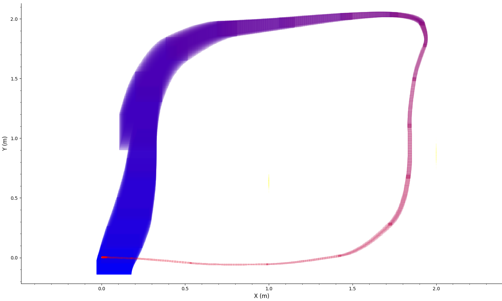

Welcome ! This is a prototype for the verification of STL formula on reachable tube of Neural Network Controlled System using Dynibex. It has been tested on Linux Ubuntu only.
It uses DynIbex.

Install Dynibex:
https://perso.ensta-paris.fr/~chapoutot/dynibex/index.php#download-installation

In recent Ubuntu versions you might need to do the the install in a python 2.7 virtual environement and :
sudo CXXFLAGS="-std=c++14" ./waf configure
sudo CXXFLAGS="-std=c++14" ./waf install

If dynibex is a local install add to the make file:
export PKG_CONFIG_PATH='path_to_dynibex'/share/pkgconfig 

Make the code:
Open terminal in the directory and compile using make:
make

Run to compute the reachable tube of a simple robot navigating in a grid of motion primitives:
./simulation.out

An example with a nonlinear closed-loop car model inspired by the Dubins model is provided:

```
make
./simulation.out
```

If it runs correctly, you should see output similar to:

```
---------------Sequence : 3---------------
---------------Node : 0---------------
Layer 1: 40 x 3
Layer 2: 20 x 40
Layer 3: 2 x 20
Processing simulation 0 -> result/predicate_3.000.txt, result/jn_box_3.000.txt
Files saved: result/predicate_3.000.txt, result/jn_box_3.000.txt

---------------Sequence : 4---------------
---------------Node : 0---------------
Layer 1: 40 x 3
Layer 2: 20 x 40
Layer 3: 2 x 20
```

The reachable sets will be saved in the /result folder.

## STL Formula Verification

Verification is performed bottom-up using the syntax tree of the formula and satisfaction signals.

Supported operators:

```
phi1 = neg_stl(phi);                        // Logical negation: ¬phi
phi1 = and_stl(phi2, phi3);                 // Logical AND: phi2 ∧ phi3
phi1 = or_stl(phi2, phi3);                  // Logical OR: phi2 ∨ phi3
phi1 = until_stl(phi2, phi3, {t1, t2});     // Until operator: phi2 U[t1,t2] phi3
phi1 = Finally(phi, {t1, t2});              // Eventually operator: F[t1,t2] phi
phi1 = Globally(phi, {t1, t2});             // Always operator: G[t1,t2] phi
```

Predicate satisfaction:

```
predicate_satisfaction(sim, predicates);
```

This constructs satisfaction signals for a list of predicates and the simulation object.
The output is a list of signals corresponding to each predicate.

Display signals:

```
print_Satisf_Signals(phi);
```

This displays the satisfaction signal of a given formula.

## Neural Network Details (MLP)

This prototype uses Multilayer Perceptrons (MLP).

* Weights and biases should be stored in the same format as provided examples:
  Each line of weights corresponds to the connections from the previous layer.
  Biases are specific to each neuron in a layer.

* The activation function for hidden layers can be changed in DnnAff.cpp by commenting or uncommenting the relevant function.
  The same activation function must be used in all hidden layers.

* The output set is computed as:
```
  std::vector<Affine2Vector> output =
  DeepNeuralNetwork\_aff(Inputs, ".../weights.txt", ".../biases.txt");
```

Here, Inputs is a vector of affine forms (std::vector<Affine2Vector>), each corresponding to one input of the neural network.

****************
Image: Reachable tube of a nonlinear car model driven by a Neural Network in closed loop using Dynibex
<p align="center">
  
</p>

